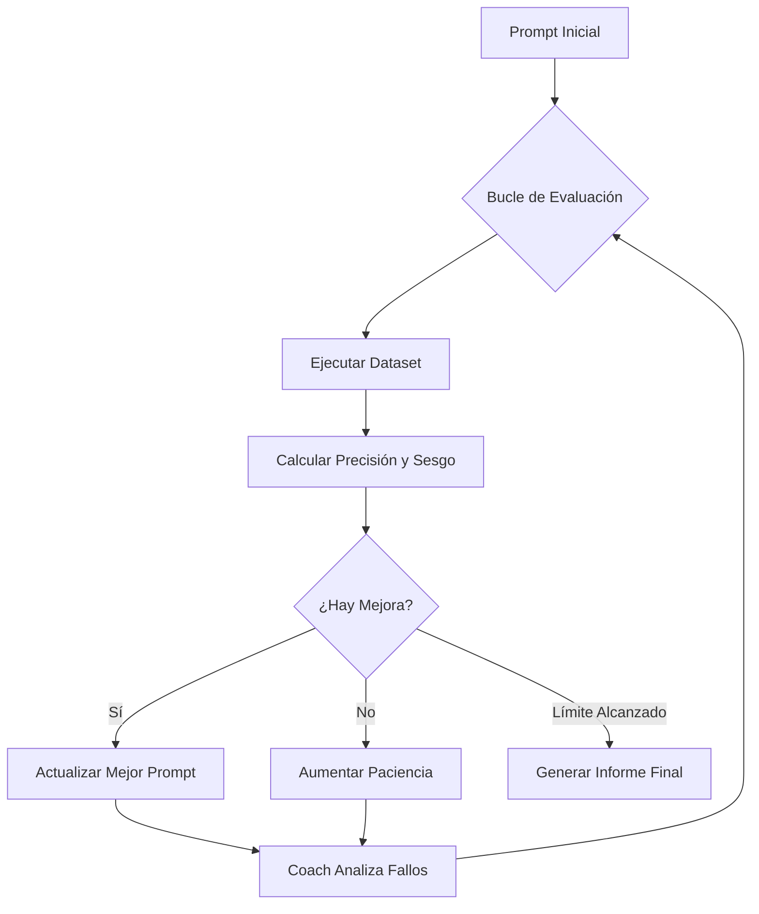

| <sub>[🇺🇸 Read in English](./README.md)</sub> |

---

# 🚀 Optimizador de Router LLM
**Ingeniería de Prompts Autónoma mediante Pruebas de QA Iterativas**

> [!NOTE]
> **🚧 Trabajo en Progreso:** Este proyecto está en desarrollo activo. Aunque el motor principal es completamente funcional, actualmente estoy refinando las funciones de reporte y la lógica de sesgo (bias). Consulta la **Hoja de Ruta (Roadmap)** al final para ver las próximas funciones.

## 📖 Visión del Proyecto
Este sistema fue diseñado para optimizar un **Modelo de Router** que actúa como el "cerebro" de un ecosistema de IA más amplio. El router decide si una consulta requiere una búsqueda en internet o puede responderse usando conocimiento interno. Si se requiere búsqueda, genera una frase de búsqueda optimizada para una API; los resultados son sintetizados posteriormente por un modelo de mayor capacidad.

## 🛠️ El Sistema de Optimización
Para lograr el prompt de router perfecto, desarrollé un bucle de entrenamiento autónomo que trata la **Ingeniería de Prompts como un proceso de Software QA**.

### El Bucle de Entrenamiento:
- **Evaluación Base (Baseline)**: Ejecuta un conjunto de datos equilibrado a través del prompt actual del Router.
- **El Coach (Gemma 2 9B)**: Un modelo más inteligente analiza los registros de fallos y sugiere mejoras quirúrgicas.
- **Refinamiento Iterativo**: El sistema solo conserva los cambios que aumentan la precisión de forma medible.
- **Lógica de Paciencia**: El proceso se detiene tras fallar en mejorar la mejor puntuación histórica durante 3 rondas consecutivas.

## 🔄 Flujo del Sistema


---

> 📊 **Ejemplo de Análisis en Vivo**: Antes de profundizar en la metodología técnica, puedes ver un ejemplo completo del informe de optimización generado aquí: **[Optimization_Report_Example.md](./Optimization_Report_Example.md)**

---

## 🧪 Metodología "QA-First"
Basándome en mi **experiencia en Software Quality Assurance (QA)**, este proyecto prioriza la **validación y la trazabilidad**:

### 1. La Métrica de Sesgo (Bias Metric)
En lugar de un simple porcentaje de "pasa/falla", desarrollé una **Métrica de Sesgo Direccional** personalizada para entender la "personalidad" de los errores del modelo:
- **Tipo 1 (Perezoso)**: El modelo no busca cuando debería (Falso Interno).
- **Tipo 2 (Paranoico)**: El modelo busca información general que ya posee (Falsa Búsqueda).

**Fórmula:**

$$
\text{Sesgo \%} = \left( \frac{\max(\text{Tipo 1, Tipo 2})}{\text{Total de Fallos}} - 0.5 \right) \times 2 \times 100
$$

> [!TIP]
> Un sesgo del 0% indica un modelo perfectamente equilibrado, mientras que el 100% indica un modelo que solo comete un tipo de error.

### 2. Informes Exhaustivos
Cada sesión genera un **Informe en Markdown** detallado que incluye:
- **Resumen Ejecutivo**: Delta de precisión y sesgo respecto al inicio.
- **Desglose por Categoría**: Rendimiento en diferentes tipos de consulta (Clima, Noticias, etc.).
- **Registros de Evolución**: Historial ronda por ronda de cada versión de prompt utilizada.

### 3. Registro de Alto Rendimiento (No Bloqueante)
Para mantener el "pintado" en terminal en tiempo real sin la latencia de E/S de disco, implementé un **Logger en Buffer**:
- **Monitoreo en Tiempo Real**: Los resultados se imprimen instantáneamente usando `print(flush=True)`.
- **Logs en Buffer de Memoria**: Los registros detallados se guardan en memoria para no ralentizar al modelo Coach.
- **Volcado Atómico**: El log completo se escribe en disco en una sola operación al finalizar, garantizando impacto cero en el rendimiento.

## 🚀 Primeros Pasos

### 0. Requisitos Previos
- **Ollama** instalado y ejecutándose.
- **Descargar Modelos**: Asegúrate de tener los modelos disponibles localmente:
  ```bash
  ollama pull llama3
  ollama pull gemma2:9b
  ```

### 1. Instalación
```bash
git clone https://github.com/CatInThePocket/Router-Coach/
cd router-optimizer
pip install -r requirements.txt
```

### 2. Configuración
El sistema utiliza un archivo `config.yaml`. Se proporciona una plantilla:

```bash
cp config.yaml.example config.yaml
```

*Abre `config.yaml` y verifica los nombres de tus modelos. Puedes ajustar el número de preguntas por categoría o seleccionar "Full" para ejecutar el dataset completo.*

### 3. Ejecutar el Optimizador
```bash
python main.py
```

### 4. Salida y Trazabilidad
- **Snapshots**: Cada ronda se guarda como un JSON en `outputs/history/`.
- **Reporte**: Se genera un informe profesional en `outputs/reports/`.

## ⚙️ Referencia de Configuración


| Sección | Parámetro | Descripción |
| :--- | :--- | :--- |
| **Router** | `model` | Modelo ligero a optimizar (ej. `llama3`). |
| **Coach** | `model` | Modelo inteligente que sugiere mejoras (ej. `gemma2:9b`). |
| | `temperature` | Valores altos (0.7-1.0) permiten ideas más creativas. |
| **Paths** | `dataset` | Ruta al archivo JSON de pruebas. |

---

## 🚀 Hoja de Ruta (Roadmap)

1. **Corrección de Sesgo Condicional**: Opción para que el Coach ignore el sesgo en el prompt de mejora y solo lo reporte.
2. **Métricas de Impacto Económico**: Calcular el coste de los errores de routing (API costs en búsquedas innecesarias).
3. **"Carrusel" de Modelos**: Agotar capacidades de modelos locales antes de escalar a modelos de pago (Frontier models).
