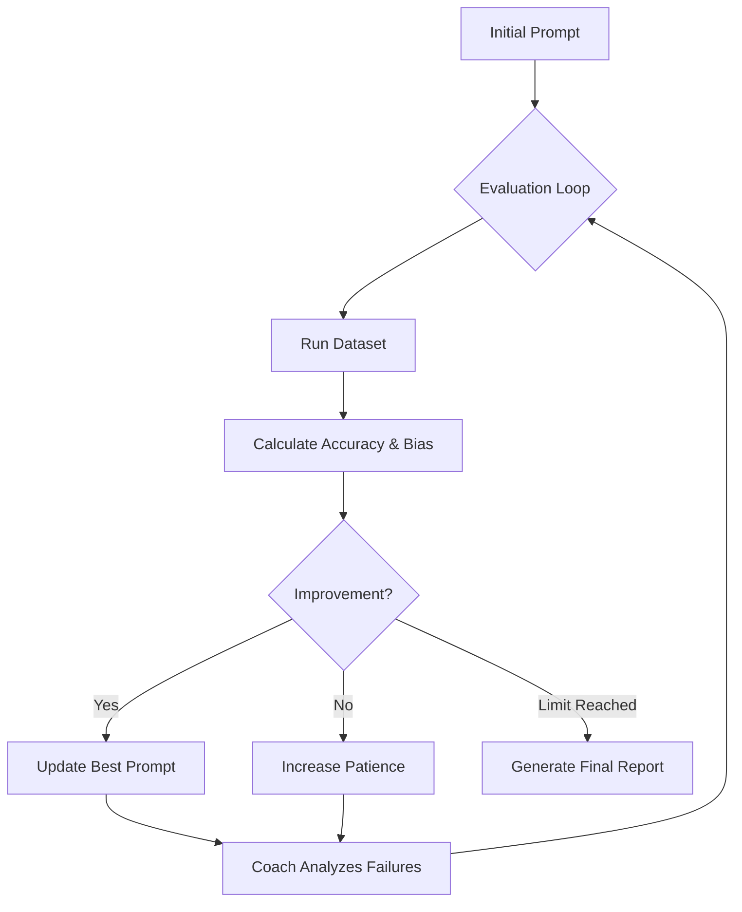

# 🚀 LLM Router Optimizer
**Autonomous Prompt Engineering through Iterative QA Testing**


> [!NOTE]
> **🚧 Work in Progress:** This project is in active development. While the core engine is fully functional, I am currently refining the reporting features and bias logic. See the **Future Roadmap** at the bottom for upcoming features.

## 📖 Project Vision
This system was designed to optimize a **Router Model** that serves as the "brain" of a larger AI ecosystem. The router decides whether a query requires internet search or can be answered using internal knowledge. If search is required, it generates an optimized search phrase for a search API, the results of which are synthesized by a larger model.

## 🛠️ The Optimization System
To achieve the perfect router prompt, I developed an autonomous training loop that treats **Prompt Engineering as a Software QA process**.

### The Training Loop:
- **Baseline Evaluation**: Runs a balanced dataset through the current Router prompt.
- **The Coach (Gemma 4 e2B)**: A smarter model analyzes failure logs and suggests surgical improvements.
- **Iterative Refinement**: The system only keeps changes that measurably increase accuracy.
- **Patience Logic**: The process only stops after failing to improve the "all-time best" score for 3 consecutive rounds.

## 🔄 System Flow



## 🧪 QA-First Methodology
Drawing from my **Software Quality Assurance (QA) background**, this project prioritizes **validation and traceability**:

### 1. The Bias Metric
Rather than just a "pass/fail" percentage, I developed a custom **Directional Bias Metric** to understand the "personality" of the model's errors:
- **Type 1 (Lazy)**: The model fails to search when it should (False Internal).
- **Type 2 (Paranoid)**: The model searches for general knowledge it already has (False Search).

**Formula:**

$$
\text{Bias \%} = \left( \frac{\max(\text{Type 1}, \text{Type 2})}{\text{Total Failures}} - 0.5 \right) \times 2 \times 100
$$

> [!TIP]
> A 0% bias indicates a perfectly balanced model, while 100% indicates a model that only makes one type of error.


### 2. Comprehensive Reporting
Every session generates a detailed **Markdown Report** featuring:
- **Executive Summary**: High-level delta in accuracy and bias.
- **Category Breakdown**: Performance across different query types (Weather, News, etc.).
- **Evolution Logs**: A round-by-round history of every prompt version used.

### 3. High-Performance Logging (Non-Blocking)
To maintain real-time terminal "painting" without the latency of disk I/O, I implemented a **Buffered Logger**:
- **Real-Time Monitoring**: Evaluation results are flushed to the terminal instantly using `print(flush=True)`.
- **Memory-Buffered Logs**: To avoid slowing down the LLM coaching rounds, detailed query logs are held in a memory buffer.
- **Atomic Log Dump**: The full session log is written to the disk in a single operation only after the optimization process completes, ensuring zero performance impact on the training loop.

## 🚀 Getting Started

### 1. Installation
Clone the repository and install the necessary dependencies.


# Clone the repository
git clone https://github.com/CatInThePocket/Router-Coach/
```bash
cd router-optimizer
```
# Install dependencies
```bash
pip install -r requirements.txt
```

### 2. Configuration Setup
The system uses a local `config.yaml`. A template is provided to ensure a quick setup:


# Create your local config from the template
```bash
cp config.yaml.example config.yaml
```

*Open `config.yaml` and verify your model names (e.g., `llama3` for the router and `gemma2:9b` for the coach).*

Select the different values based on the test you want to run. Number of questions will randomly select that number of questions for each category. Selecting Full will run every question for eah round.

### 3. Running the Optimizer
Start the autonomous loop by running the main script from the project root:


python main.py


### 4. Output & Traceability
- **Real-time**: You will see the evaluation "painting" on your terminal.
- **Logs**: A buffered session log is dumped to `outputs/logs/session.log`.
- **Snapshots**: Every round is saved as a JSON snapshot in `outputs/history/`.
- **Report**: A professional Markdown report with **Bias Analysis** is generated in `outputs/reports/`.

## ⚙️ Configuration Reference

The `config.yaml` file controls the behavior of both the Router and the Coach.


| Section | Parameter | Description |
| :--- | :--- | :--- |
| **Router** | `model` | The lightweight model being optimized (e.g., `llama3`). |
| | `timeout` | Max seconds to wait for a routing decision (default 30-180). |
| **Coach** | `model` | The smarter model suggesting improvements (e.g., `gemma2:9b`). |
| | `temperature` | Higher values (0.7-1.0) allow for more creative prompt ideas. |
| | `max_iterations` | Total number of optimization rounds to attempt. |
| | `patience_limit` | How many rounds to wait for improvement before stopping. |
| **Paths** | `dataset` | Path to your ground-truth JSON file. |
| | `reports_dir` | Where the final Markdown analysis will be saved. |

## 📂 Project Structure
- `src/`: Core logic (Router evaluation, Coaching, and History).
- `data/`: Evaluation datasets and sampled test sets.
- `prompts/`: Version-controlled system prompts for the Router and Coach.
- `outputs/`: JSON snapshots, session logs, and final Markdown reports.

## 🔍 Traceability & Reproducibility
- **Snapshots**: Every evaluation generates a unique JSON snapshot.
- **Session Logs**: Detailed runtime logs are captured in `outputs/logs/session.log`.
- **Version Control**: Prompts are stored as discrete text files for easy A/B testing.

---

## 🚀 Future Roadmap

I am currently iterating on several high-value features to transition this tool from a research prototype to a production-ready optimizer:

### 1. Conditional Bias Correction
While the Bias Metric is a core feature, forcing the Coach to correct it in every iteration might lead to "over-correction" in certain niche datasets. I plan to implement a configuration toggle (`bias_correction: true/false`) to allow the Coach to either act on the bias or simply observe it for reporting purposes.

### 2. ROI & Economic Impact Metrics (Cost of Error)
Prompt optimization isn't just about accuracy; it's about economics. I am exploring a weighted cost-analysis model to quantify the financial impact of routing errors:
- **Cost of Over-Searching (Type 2 Error)**: Calculating the literal API and compute cost wasted by sending queries to a Search Provider that could have been handled internally.
- **Cost of Under-Searching (Type 1 Error)**: Defining a metric for "Information Loss" or "Hallucination Risk" when the system fails to fetch real-time context.

### 3. Cascading "Model Carousel"
To maximize efficiency and minimize subscription costs, I am developing a **Model Carousel** logic:
- **Local Exhaustion**: Utilizing local models (e.g., Llama 3, Gemma 2) for the bulk of the iterative cycles.
- **Frontier Escalation**: Automatically escalating the prompt to a Frontier model (e.g., GPT-4o, Claude 3.5) only for the final high-precision refinement once local models reach a performance plateau.
